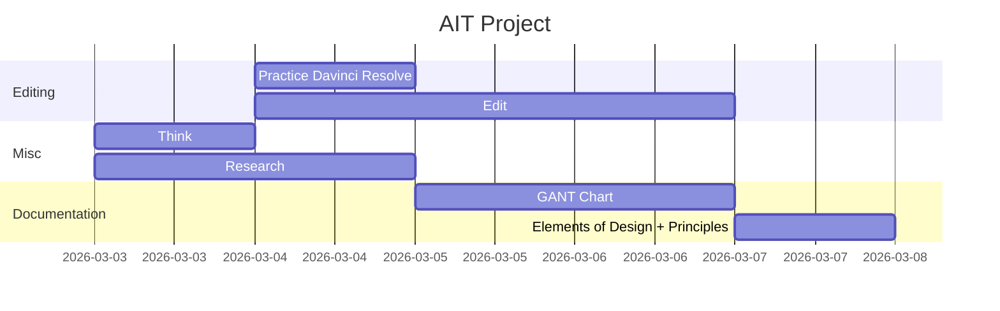
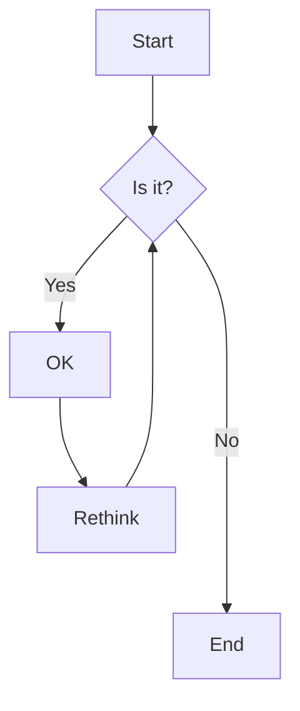
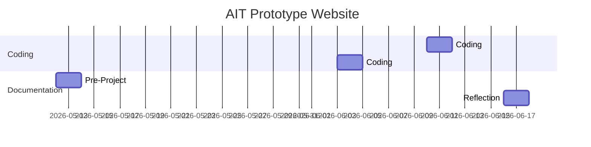

##### Design Process
The stages you work through in order to create pa product.

##### Purpose
What is the product upposed to do.

##### Target Audience
Who is using the product.

##### Content
Content that suits the target audience i.e. children like bright colours, happy imagery

##### Medium
how the product is being presented. i.e. Via the *mediums* of Radio, tv, mobile device, book etc

##### Concepts
The *potential ideas* that you come up with for your product i.e. sketches diagrams, wireframes etc.

##### Design Criteria
These are the specifications that your product must inclu/de i.e. must be made of wood, have a gas lifter, be priced under $500 etc.

##### Situation Analysis 
Looking at the factors that might affect the delivery of the product. 
i.e. Can we get the resources to make it? Will it be out of date by the time it is made? Do people have the ability to access it?

##### Style Guide
These are the standards that you must abide by when creating the product.

E.g. Mcdonalds products have the M logo, its always yellow, the font is the same across their products egc.

##### GANTT Chart
Used towork otu what task need to be done and when
e.g.

##### Storyboards / Sketches
USeed to give a visual overview of what the product may look like. Usually annotated with details

##### Wireframe
A visual guide that represents the skeletal framework of a website. Think of it as a sketch for how your website will look and the placement of objects.

##### Thumbnails
Small images of pictures.

##### Site Map
a visual map of the layout of the entire website

##### Flow Chart

